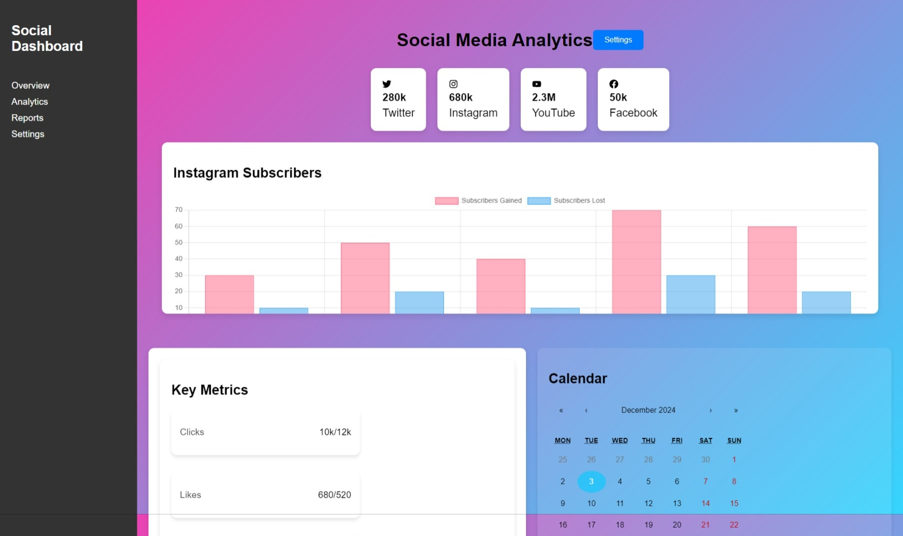

# Social-Media-Analytics-Dashboard

## 1. Task Description

The task is to create a **Social Media Analytics Dashboard** that displays the analytics of various social media platforms, such as Twitter, Instagram, YouTube, and Facebook. The dashboard includes the following features:

- **Platform Metrics**: Displays the follower count and platform-specific icons for each social media platform.
- **Analytics Charts**: Graphs showing metrics such as subscribers gained and lost over time.
- **Key Metrics Section**: Displays key performance indicators (KPIs) like clicks, likes, followers, and impressions, along with their target values for comparison.
- **Interactive Calendar**: A calendar interface showing specific events or milestones related to the analytics data.
- **Modern and Responsive Design**: The dashboard is designed with a clean, modern layout using glassmorphism and is fully responsive to fit across multiple device sizes, such as desktops, tablets, and mobiles.

---

## 2. Task Output Screenshot

---

## 3. Widget/Algorithm Used In Task

- **React Icons**:  
  We used React Icons to display icons representing each social media platform (Twitter, Instagram, YouTube, and Facebook). These icons help users quickly identify the platforms.

- **Chart.js**:  
  Chart.js is used to visualize data trends, such as subscribers gained and lost over time. The charts are created using `line` charts, where each dataset represents either the gained or lost subscribers over a range of dates.

- **Glassmorphism**:  
  The dashboard uses a glassmorphism effect to create a modern, translucent background effect for the cards and charts. This is achieved using `backdrop-filter: blur()` to add a stylish blur effect behind elements.

- **React State Management (`useState`)**:  
  React’s `useState` hook is utilized to manage the data of social media platforms, key metrics, and chart data. This allows dynamic updates of the dashboard when new data is provided.

- **CSS Flexbox and Grid**:  
  Flexbox and Grid layouts are used to structure the dashboard in a responsive way. The layout adapts to different screen sizes to ensure the dashboard is accessible on both large and small devices.

- **React Calendar**:  
  The calendar component (likely `react-calendar`) is integrated into the dashboard to highlight specific dates of interest, such as campaign dates or key metric milestones. Selected dates are visually distinct to help users track important events.

- **CSS Media Queries**:  
  CSS media queries are implemented to ensure the dashboard maintains its design integrity and is fully functional across various screen sizes. The layout adjusts dynamically based on the device's screen width.

---
